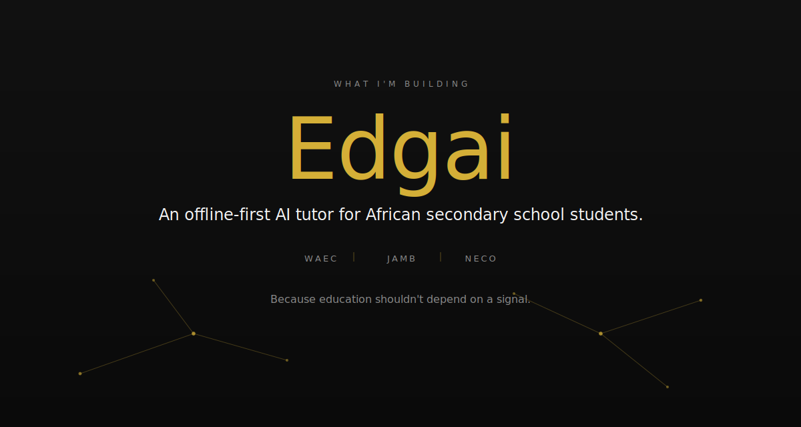
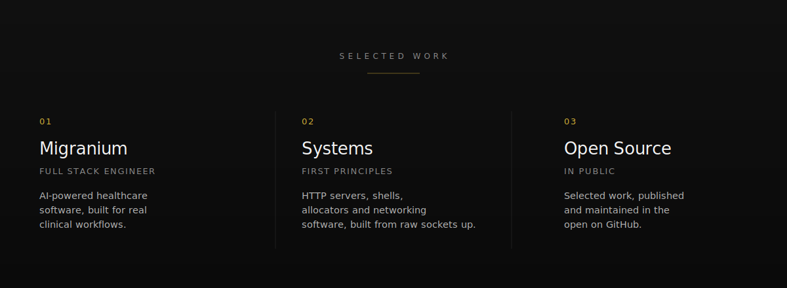
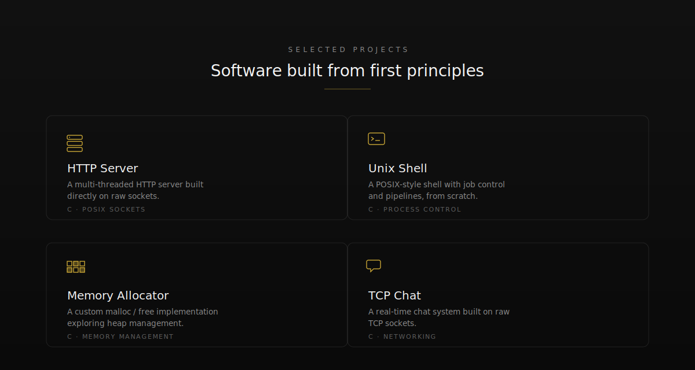
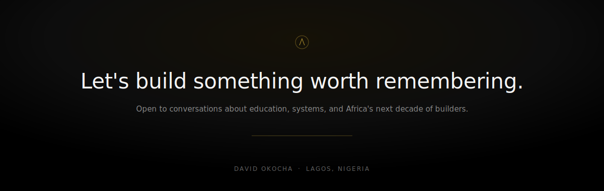

  

<b>ABOUT</b>

<h2 align="center">I care more about how systems work than what frameworks they're built on.</h2>

I love building products — but more than that, I love understanding the machinery underneath them. 
Instead of stopping at frameworks, I go looking for what they're standing on.

 

> I'd rather write an HTTP server, a shell, and a memory allocator from scratch than take a socket, a process, or a heap for granted.

 

That instinct — to understand before I depend — shapes almost everything I build, 
from production software used by real clinics to a tutor designed to work without the internet at all.

  

  

  

  

  

<b>THE NUMBERS</b>

A quiet record of consistency.

 

 

<picture>
  <source media="(prefers-color-scheme: dark)" srcset="./assets/snake-dark.svg" />
  <source media="(prefers-color-scheme: light)" srcset="./assets/snake.svg" />
  
</picture>

  

<a href="https://github.com/IAmMonarch">GitHub</a> &nbsp;&#183;&nbsp;
<a href="mailto:davidokocha086@gmail.com">Email</a> &nbsp;&#183;&nbsp;
<a href="https://github.com/IAmMonarch">Edgai</a>

